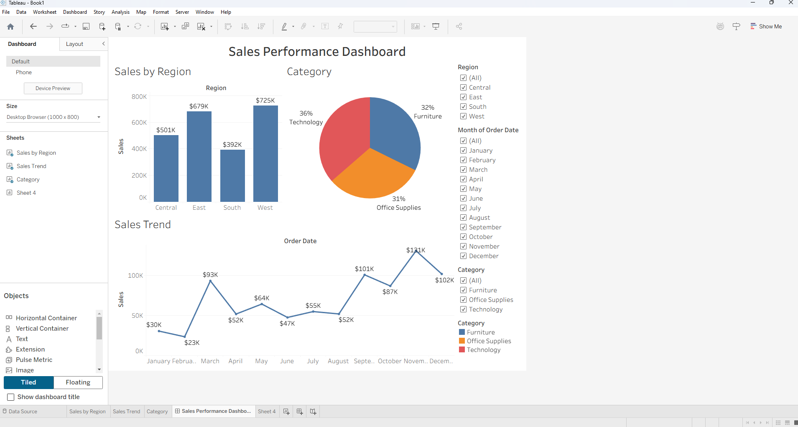

\# Sales Performance Dashboard (Tableau)

\## Project Overview

This project analyzes sales data using Tableau to identify trends, top-performing regions, and key business insights.

\## Tools Used

\- Tableau

\- Excel

\## Key Insights

\- West region generated highest sales

\- Technology category had highest profit

\- Sales increased significantly in Q4

\## Dashboard Preview

\## Files Included

\- Tableau Workbook (.twb)

\- Dataset (.csv)

\- Dashboard Screenshot

\## Skills Demonstrated

\- Data Visualization

\- Dashboard Design

\- KPI Analysis

